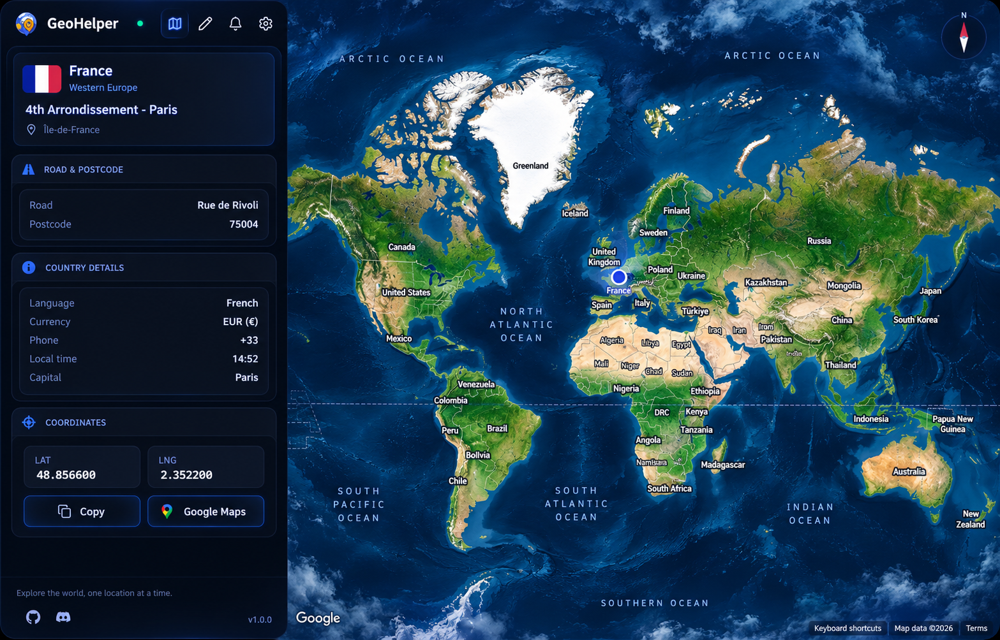
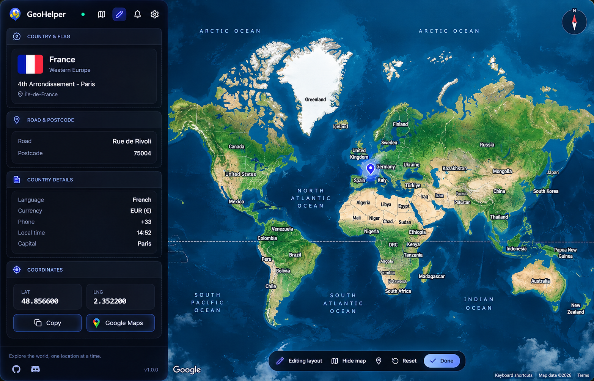

<div align="center">
  

  <h1>GeoHelper</h1>

  <p><strong>Un complemento de escritorio para GeoGuessr en Steam.</strong></p>
  <p>Coordenadas en tiempo real · País · Región · Carretera · Código postal · Bandera · Mapa</p>

  <p>
    <a href="https://github.com/Zerinho23"></a>
    
    
    <a href="LICENSE"></a>
  </p>
</div>

> [!NOTE]
> **Actualizaciones manuales por Discord**
>
> Las nuevas versiones se distribuyen manualmente por Discord. Esta versión tiene desactivada la búsqueda e instalación de actualizaciones automáticas.

<p align="center">
  
</p>

## ¿Qué es GeoHelper?

GeoHelper es una aplicación de escritorio que muestra información de las rondas de **GeoGuessr en Steam**: coordenadas, país, región, carretera, código postal y una vista del mapa.

Está orientada a mapas personalizados, partidas individuales, práctica y aprendizaje de geografía.

## Características

- **Información en tiempo real:** coordenadas y detalles de la ubicación durante la partida.
- **Interfaz personalizable:** permite mover secciones, cambiar colores y tamaños de texto y ajustar el marcador.
- **Mapas:** OpenStreetMap y opción de Google Maps con tu propia clave de API.
- **Aplicación de escritorio:** construida con React, Tauri y Rust.
- **Web con detalles azules:** botones, títulos, iconos y efectos de fondo con la misma paleta.
- **Distribución manual:** las nuevas versiones se comparten por Discord.

## Primeros pasos

1. Obtén la versión distribuida por Discord para tu sistema e instálala o abre su ejecutable, según el paquete.
2. En Steam, haz clic derecho en **GeoGuessr → Propiedades → Opciones de lanzamiento** y añade:

   ```text
   --remote-debugging-port=34788 --remote-allow-origins=*
   ```

3. Abre GeoGuessr y GeoHelper para comenzar.

La conexión con el juego utiliza su interfaz local de Chrome DevTools Protocol. Los mapas y los servicios de información geográfica pueden necesitar conexión a Internet.

## Hazlo tuyo

Pulsa el icono del lápiz para entrar en el modo de edición:

- Arrastra las secciones para cambiar su orden.
- Personaliza el tamaño, color y estilo del texto.
- Ajusta el marcador y el ancho de la barra lateral.
- Oculta el mapa o las secciones que no necesites.
- Cambia entre los temas disponibles.

<p align="center">
  
</p>

## Compilar el programa de PC

Necesitas Bun y Rust, además de las herramientas de desarrollo de Tauri para tu sistema. En Windows se utilizan las herramientas de C++ de Visual Studio y WebView2.

Desde la carpeta principal del proyecto:

```bash
bun install --frozen-lockfile
bun run dev
```

Para generar un instalador de Windows:

```bash
bun run build:local --bundles nsis
```

El instalador se genera en `src-tauri/target/release/bundle/nsis/`.

Para ejecutar las comprobaciones del programa:

```bash
bun run check
```

## Web

La web está en `site` y utiliza Next.js. Incluye el logo y las capturas actualizadas, detalles en azul y un enlace al perfil de GitHub.

Para trabajar en ella desde la carpeta principal:

```bash
cd site
bun install --frozen-lockfile
bun run dev
```

Para comprobarla y compilarla:

```bash
bun run lint
bun run build
```

En Vercel, selecciona **Next.js**, el directorio raíz **site**, el comando de instalación `bun install --frozen-lockfile` y el comando de compilación `bun run build`. Conserva el directorio de salida automático y permite el acceso al `package.json` de la carpeta superior, que proporciona la versión de la aplicación.

## Perfil

[Mi perfil de GitHub — Zerinho23](https://github.com/Zerinho23)

## Uso

GeoHelper es una herramienta de práctica personal y educativa. El uso de ayudas en modos competitivos puede incumplir las condiciones de GeoGuessr.

## Licencia

Este proyecto se distribuye bajo la [licencia MIT](LICENSE). Se conservan los avisos de copyright de sus colaboradores.
